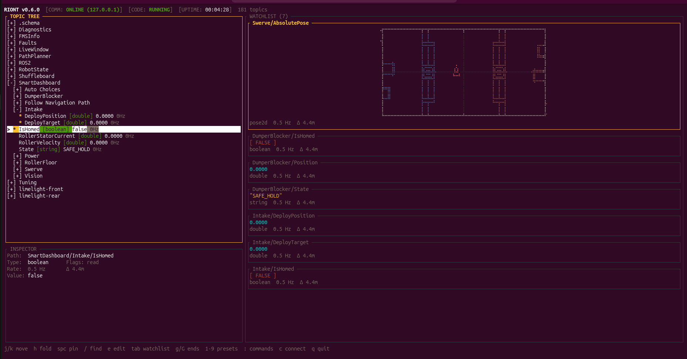
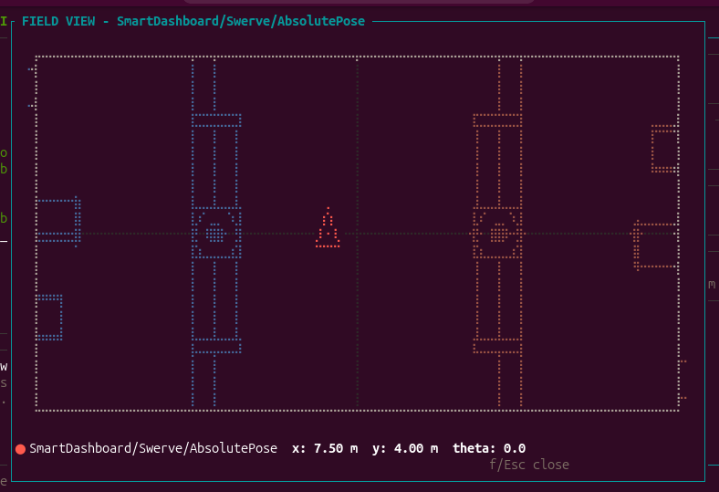
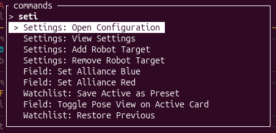

# RIoNT — Robot Inspection Over Network Tables

A keyboard-only NetworkTables (NT4) dashboard for FRC. Rust + ratatui. Pronounced "RINT"

Find a topic fast, see its value clearly, right now — with nothing to
configure.



## Features

- **Topic tree** — collapsible namespaces with inline values, type tags and
  publish rates; fuzzy search with `/` jumps straight to a topic.
- **Inspector dock** — passively mirrors the cursor's full path, type,
  flags, rate, Δ and raw value. No navigation needed to read metadata.
- **Watchlist** — `Space` pins any topic as a live card, sized by type;
  a directory pin becomes a GROUP: its cards get their own column under
  a `─ Folder (n) ─` header (n = live topic count), overflowing into
  further header-topped columns when large. Ungrouped cards pack
  top-down; columns beyond the pane scroll in with h/l; repacking is
  live.
- **Field visualization** — robot pose topics render as a braille top-down
  field with live position, heading and trail (details below).
- **Inline editing** — `e` publishes a new bool / int / double / string
  value over NT4. While offline, edits are queued and sent on reconnect.
  Every edit is verified by read-back over a second connection; an edit
  the robot does not hold surfaces a warning.
- **Command palette** — `:` opens a fuzzy action runner: view/edit
  settings, manage saved targets, save/load presets, reconnect, restart
  robot code over SSH, copy a topic path.
- **Connection picker** — `c` connects to a saved target or any typed
  address (team number, IP, or IP:port).
- **Workspace presets** — `1`-`9` loads a named topic list from
  `config.json`. A trailing `/*` pins a whole subtree and adopts topics the
  robot starts publishing later.
- **Driver-station HUD** — `COMM` (link state + failure reason),
  `CODE` (robot code RUNNING/STOPPED) and `RUNTIME` (how long the current
  connection has been up; freezes on disconnect, restarts from zero on
  reconnect). No RTT, no global Hz.
- **Telemetry neutrality** — rates and deltas render in muted grey; no
  stale flags, no alarms. Slow-but-alive topics are normal.
- **Resilience** — auto-reconnects forever; the watchlist persists across
  restarts and crashes.

## Keymap

| Key | Tree | Watchlist |
| --- | --- | --- |
| `j` `k` / up-down | move | move row |
| `h` `l` / left-right | toggle folder fold | move card |
| `g` / `G` | top / bottom | first / last card |
| `Space` | pin topic to watchlist (dir = whole subtree) | unpin active card |
| `x` | — | dismiss active card |
| `f` | — | enlarged field view (toggle) on a hovered field card |
| `o` | — | overlay: merge field cards into one composite field |
| `e` / Enter | edit value (bool/int/double/string) | edit active card |
| `Tab` | → watchlist | → tree |
| `/` | fuzzy search; `Space` pins a match, `Enter` jumps to it | |
| `c` / `Shift+C` | connection picker | |
| `:` / `Ctrl-P` | command palette | |
| `1`-`9` | load workspace preset | |
| `u` | restore previous watchlist (undo a preset load / clear) | same |
| `q` / `Ctrl-C` | quit | |

## Screenshots

Enlarged field view (`f` on a field card) — the robot's live pose over the
season map:



Command palette (`:`) — a fuzzy action runner over every command:



## Field visualization

A pinned topic whose value is a robot pose renders as a braille top-down
field with a live robot marker and a pose trail. The robot is drawn as a
rectangle footprint with a center orientation arrow (inside the frame);
the footprint size comes from `config.json` (`field.robot_length_m` /
`field.robot_width_m`, meters, defaults 0.9 × 0.9). Small cards adapt:
the full rectangle+arrow is drawn while it spans enough braille dots to
read, then a rect+tick, then a compact chevron — always keeping position
and heading accurate.

- **Auto-detected, conservatively:** only exact Limelight pose topics
  (`botpose`, `botpose_wpiblue`, `botpose_wpired`, `botpose_orb_*`, any
  camera prefix) and WPILib `struct:Pose2d` topics. Lookalikes — target
  poses, arbitrary `double[6]` arrays — stay ordinary value cards.
- **Manual opt-in:** the palette command `Field: Toggle Pose View on Active
  Card` forces a field card on a lookalike topic.
- **Overlay groups:** `o` on a field card merges it with other overlaid
  field cards into ONE composite card — compare odometry against a vision
  estimate on a single field, with a per-topic legend. `o` again unmerges.
- **Alliance color** follows the exact `FMSInfo/IsRedAlliance` topic
  (neutral cyan without FMS); flipping the field geometry is a deliberate
  user setting (`Field: Set Alliance Red/Blue`), never automatic.

## Usage

```
riont 9986            # team number -> 10.99.86.2
riont 172.22.11.2     # direct IP (USB tether)
riont 127.0.0.1:5810  # explicit host:port (e.g. robot simulation)
riont                 # last successfully connected target, else 172.22.11.2
```

Connects on TCP 5810 (NT4 WebSocket) and auto-reconnects forever. The last
successfully connected target is remembered and reused by a bare `riont`
launch. Retarget mid-session with `c`.

## Settings & persistence

Everything lives in `~/.config/riont/config.json` (override the path with
the `RIONT_CONFIG` environment variable — useful for portable installs):

```json
{
  "last_target": "10.1.18.2",
  "saved_targets": [
    {"name": "Simulation", "ip": "127.0.0.1:5810"},
    {"name": "USB Tether", "ip": "172.22.11.2"},
    {"name": "Team 118",   "ip": "10.1.18.2"}
  ],
  "presets": {
    "swerve": ["Swerve/*", "SmartDashboard/Battery Voltage"],
    "vision": ["limelight-front/*"]
  },
  "system": {
    "ssh_user": "admin",
    "restart_cmd": "/usr/local/frc/bin/frcRunRobot.sh restart"
  }
}
```

Presets are saved from the palette (`Watchlist: Save Active as Preset`) and
load with `1`-`9`. Commit `config.json` to your team repo so everyone gets
the same views. The live watchlist persists to `last_view` after every
change and is restored on the next launch.

## Development & releases

- **Tests:** `cargo test` (in-process, milliseconds) and
  `python test/harness.py` (end-to-end contract harness). CI runs both on
  every push/PR, on Linux, Windows and macOS.
- **Changelog:** user-visible changes add a bullet under `## [Unreleased]`
  in `CHANGELOG.md` in the same commit. Versions move only at release time.
- **Cutting a release:** `scripts/release.sh <patch|minor|major> "summary"`,
  then `git push --follow-tags` — CI builds and attaches Windows/Linux/
  macOS binaries to the GitHub release.

See [CONTRIBUTING.md](CONTRIBUTING.md) for building from source, the code
layout, the NT4 protocol notes and the full testing/release walkthrough.

## Contributing

Contributions are welcome — bug reports with screenshots (the HUD version
identifies your exact release) and focused PRs. Read
[CONTRIBUTING.md](CONTRIBUTING.md) first; `ROADMAP.md` records what RIONT
is, what it deliberately is not, and what's worth building next.
